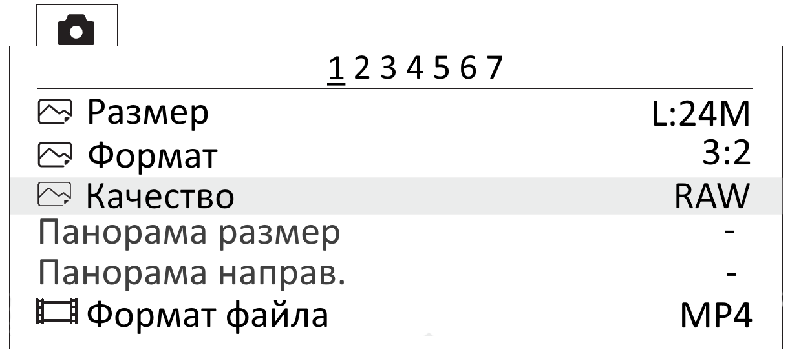

Настройка фотокамеры
=========================

Настройка камеры Sony DSC-RX1RM2
------------------------------------------

.. |icon_cam| image:: _static/_images/icon_cam.png
    :width: 25

.. |icon_key| image:: _static/_images/icon_key.png
    :width: 25

.. |icon_set| image:: _static/_images/icon_set.png
    :width: 25

.. |icon_bag| image:: _static/_images/icon_bag.png
    :width: 25

.. |icon_sd| image:: _static/_images/icon_sd.png
    :width: 25

Перед выполнением настроек ознакомьтесь с `инструкцией по эксплуатации фотокамеры <https://www.sony.ru/electronics/support/res/manuals/4469/44695786M.pdf>`_, в которой описано назначение и использование органов управления.

* Диск режимов установите в положение **S** (Приоритет выдержки).
* Установите выдержку **1/1000**.
* Диск коррекции экспозиции установите в положение **0** (ноль).
* Кольцо переключения макро установите в положение **0,3m-∞**.
* Диск режима фокусировки установите в положение **MF**.

Для настройки нужно нажать на кнопку **MENU**, затем, в соответствии с пунктами ниже, установить требуемые значения.

* В меню пользовательских настроек |icon_set| (вкладка 1) отключите **Автоматический просмотр**.

.. figure:: _static/_images/menu2.png
   :width: 400
   :align: center

   Отключение автоматического просмотра

* Установки для кнопки **MOVIE** — **Только режим видео** (вкладка 3).

.. figure:: _static/_images/menu11.png
   :width: 400
   :align: center

   Установка значения «Только режим видео»

* В меню настроек |icon_key| (вкладка 2) установите **Время начала энергосбережения** — **30 мин**.

.. figure:: _static/_images/menu1.png
   :width: 400
   :align: center

   Установка времени начала энергосбережения

* В меню карты памяти |icon_sd| установите **Номер файла** — **Сброс**.

.. figure:: _static/_images/menu3.png
   :width: 400
   :align: center

   Сброс номера файла

Другие настройки камеры изменять не требуется.

**Форматирование карты памяти**

1) Последовательно выберите **MENU →** |icon_sd| **[Карта памяти]** **→ Форматировать**

.. attention::  Все данные на карте памяти будут удалены!

**Сброс настроек**

Для сброса всех настроек:

1) Последовательно выберите **MENU →** |icon_key| **[Настройки] → Инициализировать  → Сброс настроек**

.. attention::  Не извлекайте батарейный блок во время сброса или преустановки значений настроек!

2) После сброса установите время и дату. Если пропустить это действие, настройки фотокамеры сохраняться не будут.
3) Выключите камеру с помощью переключателя ON/OFF. 
4) Не отключайте фотокамеру от сети или АКБ в течение 3-х минут для сохранения настроек во внутреннюю память.

.. important:: Фотокамера может выводить сообщение **E:61:00**. Это означает, что он сфокусирован на максимальную дальность. На работоспособность не влияет.

Настройка фотокамеры Sony А6000
------------------------------------

Перед выполнением настроек ознакомьтесь с инструкцией по эксплуатации фотокамеры, в которой описано назначение и использование органов управления.

* Диск режимов установите в положение **S** (Приоритет выдержки).

С помощью диска установите следующие параметры:

.. csv-table:: 
   
   "Выдержка", "1/1000"
   "ISO", "Auto"

* В меню фотосъемки (вкладка 2) установите **Режим фокусировки** — **Ручной фокус**.

.. figure:: _static/_images/menu4.png
   :align: center
   :width: 400

   Установка ручного фокуса для режима фокусировки

* В меню пользовательских установок (вкладка 1) отключите **Автоматический просмотр**.

.. figure:: _static/_images/menu5.png
   :align: center
   :width: 400

   Отключение автоматического просмотра

* В меню пользователя (вкладка 3) включите **Cпуск без объектива**.

.. figure:: _static/_images/menu6.png
   :align: center
   :width: 400

   Включение спуска без объектива

* В меню пользовательских установок (вкладка 6) установите для кнопки **MOVIE** — **Только режим видео**.

.. figure:: _static/_images/menu7.png
   :align: center
   :width: 400

   Установка значения «Только видео»

* В меню (вкладка 2) установите **Время начала энергосбережения** — **30 мин**.

.. figure:: _static/_images/menu8.png
   :align: center
   :width: 400

   Установка энергосбережения

* В меню (вкладка 5) установите **Номер файла** — **Сброс**.

.. figure:: _static/_images/menu9.png
   :align: center
   :width: 400

   Сброс номера файла

Настройка фотокамеры Sony A6000 NIR
-----------------------------------------

В меню фотосъемки установите следующие параметры:

* **Качество** - **RAW** в меню фотосъемки (Вкладка 1);

   Установка качества

* **ISO** не более 400 (для настройки нажать колесико управления вправо);

* **Коррекция экспозиции** от **EV +1** до **EV +2** (для настройки нажмите колесико управления вниз).
  

Учёт смещения центров фотографирования
------------------------------------------

Так как геодезический приемник расположен внутри консоли БВС, его центр находится в стороне от камеры.

Параметры смещения следует учитывать при точном построении ортофотопланов и 3D-моделей.

.. figure:: _static/_images/offsets.png
   :align: center
   :width: 800

   Офсеты для Геоскан 201

Значения офсетов для левого слота:

+--------------+-------+-------+-------+
| Камера, угол | x     | y     | z     |
+==============+=======+=======+=======+
| A6000, надир | 0.505 | 0.180 | 0.033 |
+--------------+-------+-------+-------+
| RX1RM2, 15°  | 0.503 | 0.181 | 0.033 |
+--------------+-------+-------+-------+
| RX1RM2, 20°  | 0.505 | 0.175 | 0.25  |
+--------------+-------+-------+-------+

Значения офсетов для правого слота:

+--------------+-------+-------+-------+
| Камера, угол | x     | y     | z     |
+==============+=======+=======+=======+
| A6000, надир | 0.374 | 0.179 | 0.04  |
+--------------+-------+-------+-------+
| RX1RM2, 15°  | 0.357 | 0.181 | 0.033 |
+--------------+-------+-------+-------+
|RX1RM2, надир | 0.368 | 0.181 | 0.032 |
+--------------+-------+-------+-------+

Офсеты для камеры RX1RM2 при установке по центру:

+--------------+-------+-------+-------+
| Камера, угол | x     | y     | z     |
+==============+=======+=======+=======+
| RX1RM2, надир| 0.489 | 0.175 | 0.032 |
+--------------+-------+-------+-------+

Офсеты для мультиспектральной камеры RedEdge-MX:

+----------+-------+-------+-------+
| Объектив | x     | y     | z     |
+==========+=======+=======+=======+
| Синий    | 0.480 | 0.188 | 0.006 |
+----------+-------+-------+-------+
| Зеленый  | 0.509 | 0.188 | 0.006 |
+----------+-------+-------+-------+
| Красный  | 0.509 | 0.167 | 0.006 |
+----------+-------+-------+-------+
| NIR      | 0.480 | 0.167 | 0.006 |
+----------+-------+-------+-------+
| Red Edge | 0.494 | 0.177 | 0.006 |
+----------+-------+-------+-------+

Для настройки смещения в Agisoft Metashape во вкладке **Инструменты** выберите пункт **Калибровка камеры**. Установите во вкладке **Поправка GPS/INS** отклонения в метрах (см. рисунок). Обратите внимание, что поправка по оси Х вводится со знаком **+**, поправки по оси У и Z вводятся со знаком **-** .

   Вывод офсетов в Agisoft Metashape