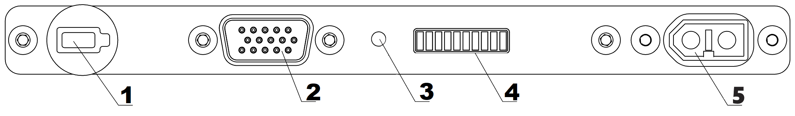

Зарядная станция и АКБ
=========================

.. csv-table:: **Характеристики АКБ**
   
   "Количество рабочих циклов (заряд-разряд)", "не менее 80"
   "Рекомендуемый ток заряда", "10 А"
   "Верхний предел напряжения", "21 В"
   "Номинальное напряжение", "18,5 В"
   "Нижний предел напряжения", "15 В"
   "Ток заряда", "68 А"
   "Количество ячеек", "5"
   "Емкость", "34 000 мА·ч"
   "Срок службы", "1 год"

Техника безопасности
----------------------

**АКБ**

* Запрещается разбирать АКБ.
* Запрещается использовать нештатные зарядные устройства и кабели для зарядки АКБ.
* Запрещается подключать батарею к выключенному зарядному устройству.
* Запрещается транспортировать АКБ в корпусе БВС (только в защитном кейсе).
* Не оставляйте АКБ надолго под прямыми солнечными лучами.
* Не допускайте длительное хранение и транспортировку АКБ при температуре ниже +3°С.

.. warning:: Категорически запрещается замыкать контакты АКБ.

**Зарядное устройство**

* Перед подключением АКБ необходимо включить зарядное устройство и выбрать режим *LiPo*.

* Перед каждым использованием необходимо производить осмотр кабелей и разъемов на предмет повреждений.

* Запрещается эксплуатировать зарядное устройство под прямыми солнечными лучами.

* Запрещается эксплуатировать зарядное устройство без присмотра.

С завода комплекс поставляется с настроенным зарядным устройством. Если настройки сбились — следуйте инструкции, чтобы их восстановить.

Предварительные настройки зарядного устройства
-------------------------------------------------

Чтобы войти в меню настроек необходимо:

* на экране PROGRAM SELECT (основной экран) многократно нажать кнопку **Batt type/Stop**, пока на дисплее не появится раздел **Settings**;

* подтвердить выбор нажатием кнопки **Start/Enter**.

Навигация по меню настроек осуществляется при помощи кнопок **Dec/Inc**;

В меню **Settings** необходимо установить следующие настройки:

* снять ограничение времени заряда. Для этого необходимо при помощи кнопок **Dec/Inc** выбрать экран **Safety timer**.

При нажатии кнопки **Start/Enter** станет активна функция изменения ON/OFF, кнопкой **Dec/Inc** выберите положение *OFF*, затем нажмите **Start/Enter** пока на экране не перестанут мигать настройки.

* снять ограничение емкости заряжаемой АКБ. Для этого необходимо при помощи кнопок **Dec/Inc** выбрать экран **Capacity cut-off**. 

При нажатии кнопки **Start/Enter** станет активна функция изменения ON/OFF, кнопкой **Dec/Inc** выберите положение *OFF*, затем нажмите **Start/Enter** пока на экране не перестанут мигать настройки.

Для выхода из раздела **Settings** нажмите кнопку **Batt type/Stop**.

* На экране PROGRAM SELECT (основной экран) при помощи **Dec/Inc** выберите пункт *Lithium battery* и подтвердите нажатием кнопки **Start/Enter**, затем выберите следующие настройки:

Параметр AUTO в автоматическом режиме определяет количество ячеек (S) в аккумуляторе. Установите ток заряда 8,0 A. Остальные значения в меню настроек менять не рекомендуется.

Порядок подключения АКБ к зарядному устройству
--------------------------------------------------

1) Подключите балансировочный кабель к заряжаемой АКБ.
2) Подключите разъем силового кабеля к заряжаемой АКБ.

.. Attention:: 
 Вы можете использовать автомобильный аккумулятор 12 В в качестве источника энергии для зарядной станции. При таком варианте подключения, убедитесь, что двигатель автомобиля запущен, иначе автомобильная АКБ полностью разрядится в процессе зарядки.

Плата индикации АКБ
----------------------

+--------------------------------------------------------------------------------------------------------------------------+
|                                                Индикаторы и разъемы на корпусе АКБ                                       |
+====================+========================+=========================+===============================+==================+
|          1         |           2            |             3           |                  4            |          5       |
+--------------------+------------------------+-------------------------+-------------------------------+------------------+
| кнопка управления  | балансировочный разъем | диод статуса индикации  | светодиодная полоса индикации |  силовой разъем  |
+--------------------+------------------------+-------------------------+-------------------------------+------------------+

Нажмите на кнопку (1), чтобы просмотреть статус АКБ. После нажатия диод статуса индикации (3) загорится сначала зеленым, потом красным и оранжевым для модификации «Арктика».

Цвет диода статуса индикации (3) показывает, какие данные отобажает светодиодная полоса (4):

.. |red| image:: _static/_images/red.png
    :width: 10

| |green| Зеленый цвет — уровень заряда.
| |red| Красный — внутренняя температура.
| |orange| Оранжевый — оставшееся время поддержания температуры для модификации «Арктика».

Каждое деление индикации заряда |green| соответствует 10% емкости АКБ.

В таблице приведено соответствие количества диодов внутренней температуре АКБ |red|:

.. csv-table:: **Индикация температуры АКБ**
   :header: "Количество светодиодов", "Режим свечения", "Температура, °С"
   

   "I", "мигает", "< 5"
   "II", "мигает", "5-10"
   "III", "мигает", "10-15"
   "IIII", "горит", "15-20"
   "IIIII", "горит", "20-25"
   "IIIIII", "горит", "25-30"
   "IIIIIII", "мигает", "30-35"
   "IIIIIIII", "мигает", "35-40"
   "IIIIIIIII", "мигает", "40-45"
   "IIIIIIIIII", "мигает", ">=45"

.. Attention:: 
 Внимание! Не присоединяйте внешний источник питания к АКБ при активированном режиме индикации.

Скорость разряда АКБ напрямую зависит от уровня газа, который БВС регулирует в зависимости от погодных условий и траектории маршрута. К примеру, при построении полигона, желательно делать его прямоугольным с минимальным количеством разворотов и максимально длинными “галсами”. Следуя данным рекомендациям, вы увеличите эффективность полетов.

Управление обогревом АКБ (для комплексов с модификацией «Арктика»)
------------------------------------------------------------------------

АКБ модификации «Арктика» отличаются пиктограммой снежинки на корпусе. Использование таких АКБ допускается при температуре окружающей среды от -40 °C до +20 °C.

Если в режиме индикации нажать и удерживать кнопку (1) более 2 секунд, диод статуса индикации (3) загорится |orange| оранжевым, и батарея активирует режим поддержания температуры +(20÷30) °С на 30 минут. При этом светодиодная полоса отображает оставшееся время обогрева (каждое деление - 3 мин). Повторное длительное нажатие кнопки (1) выключит режим поддержания температуры.

В таблице приведено соответствие количества диодов оставшемуся времени поддержания температуры |orange|:

.. csv-table:: **Индикация оставшегося времени поддержания температуры АКБ**
   :header: "Количество светодиодов", "Время поддержания температуры, мин"
   

   "I", "3"
   "II", "6"
   "III", "9"
   "IIII", "12"
   "IIIII", "15"
   "IIIIII", "18"
   "IIIIIII", "21"
   "IIIIIIII", "24"
   "IIIIIIIII", "27"
   "IIIIIIIIII", "30"

Режим поддержания рабочей температуры активируется автоматически при подключении внешнего источника обогрева (аккумулятора авто) к балансировочному разъему АКБ с помощью комплектного кабеля. Диод статуса индикации загорится |orange| оранжевым, и батарея активирует режим поддержания температуры на 30 минут. Для повторной активации режима следует отсоединить и повторно вставить кабель в балансировочный разъем АКБ. 

| Рекомендуется держать авто заведенным во избежание полного разряда его АКБ.

Рекомендации по использованию АКБ и ЗУ
----------------------------------------

* Если полеты проходят при температуре воздуха ниже 0 °C, перед полетом необходимо хранить АКБ в теплом месте и не допускать её охлаждения. Следует помнить, что на холоде литий-полимерные АКБ могут терять до 30% своей емкости, данное обстоятельство необходимо учитывать при построении полетного задания.

* Если полеты проходят при температуре воздуха выше 25 °C, перед полетом необходимо хранить АКБ в прохладном, защищенном от попадания прямых солнечных лучей месте. После полета нельзя сразу заряжать АКБ, необходимо дать ей остыть. Заряжать также необходимо в прохладном месте, защищенном от попадания прямых солнечных лучей. 

* АКБ необходимо заряжать после каждого использования.
* Не допускайте перезаряда и переразряда АКБ. Напряжение на каждой ячейке не должно выходить за рамки диапазона 3,3 - 4,2 В (оптимальный уровень - 3,7 В). Для АКБ Геоскан-201 (5S) суммарное напряжение на силовом разъеме должно быть в пределах 16,5 - 21 В.
* Не заряжайте АКБ в холодном помещении, если затем планируете переносить её в теплое. Повышение температуры полностью заряженной АКБ приведет к её перезаряду, который снижает срок службы и может привести к возгоранию. 
* Не храните АКБ в полностью разряженном или заряженном состоянии. При длительном хранении (более 14 дней) желательно зарядить АКБ до уровня 50% и дозаряжать раз в 5-6 месяцев. Хранить в сухом прохладном месте, исключающем воздействие прямых солнечных лучей, при температуре от 5 до 25 °С и относительной влажности не более 80%, без конденсации.
* Литиевые АКБ подвержены старению. Интенсивность эффекта зависит от времени, температуры хранения и эксплуатации, количества циклов заряд-разряд. 
* Оптимальная температура при хранении, зарядке и эксплуатации АКБ +15 °С.
* Срок хранения - 1 год. После длительного (более 1 года) хранения нужно провести цикл полного разряда и заряда батареи.

Утилизация АКБ
----------------

.. attention:: Не выбрасывайте LiPo батареи в контейнеры для бытового мусора. Неправильная утилизация отработавших источников питания может представлять опасность для окружающей среды. Пожалуйста, утилизируйте LiPo батареи в соответствии с местным законодательством, сдавая их в ближайшие пункты переработки.

