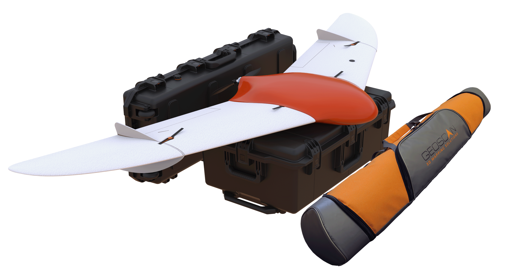

Общие сведения
-------------------

«Геоскан 201» — это аэрофотосъемочный комплекс, включающий в себя беспилотное воздушное судно (БВС) типа «летающее крыло», пусковую установку и ПО планирования полетных заданий. 

**Назначение**

Аэрофотосъемочный комплекс предназначен для проведения площадной и линейной аэрофотосъемки и съемки отдельных объектов.

**Область применения**

Полученные с использованием комплекса материалы могут быть использованы для:

* создания ортофотопланов в диапазоне масштабов 1:500 — 1:2000;
* трехмерного моделирования участка местности;
* создания карт местности;
* вычисления объемов пород в карьерах и насыпных объектах;
* обследования состояния объектов инфраструктуры, дорожного полотна;
* инвентаризации лесов и посевов;
* оценки ущерба и планирования аварийно-спасательных работ при ЧС, таких как наводнения, оползни и пожары.

.. csv-table::

   "Тип БВС", "летающее крыло"
   "Скорость полета (воздушная)", "64 - 130 км/ч"
   "Максимальная взлетная масса", "8,5 кг"
   "Максимальная масса полезной нагрузки", "1,5 кг"
   "Площадь съемки за один полет","7-22 км²"
   "Допустимая скорость ветра","12 м/с"
   "Размах крыла", "2,22 м"
   "Минимальная безопасная высота полета","100 м"
   "Максимальная высота полета","4000 м"
   "Двигатель","электрический бесколлекторный"
   "Аккумуляторная батарея","LiPo 5S AP 1370170"
   "Время подготовки к взлету","10 мин"
   "Продолжительность полета", "до 180 мин"
   "Максимальная протяженность маршрута","210 км"
   "Взлет","с пусковой установки"
   "Посадка","на парашюте, в автоматическом режиме"
   "Рабочий диапазон температур:",""
   "с АКБ Стандарт","от -20 до +40 °С"
   "с АКБ Арктика","от -40 до +20 °С"

Комплект поставки
____________________

* БВС Геоскан 201
* Радиомодем
* Стойка модема
* Зарядное устройство
* Пусковая установка в транспортировочной сумке
* Транспортировочный кейс БВС
* Раскладная подставка для сборки БВС
* Ложемент фюзеляжа
* Комплект запасных частей
* Комплект документации
* GNSS-приемник Topcon B111 `*`
* Полезная нагрузка: `*`

   * модернизированная фотокамера Sony DSC-RX1RM2;
   * модернизированная фотокамера Sony DSC-A6000;
   * модернизированная фотокамера Sony DSC-A6000 NIR;
   * мультиспектральная камера MicaSense RedEdge-MX.

`*` — *полезная нагрузка зависит от комплектации*

Обслуживание
________________

После каждого полета осматривайте БВС на предмет повреждений.

В случае повреждения лопастей винта или килей вы можете заменить их самостоятельно, используя запасные части и инструменты из комплекта поставки.

При выявлении конструкционных повреждений планера или систем необходимо обратиться в службу `технической поддержки`_ 

.. _технической поддержки: https://www.geoscan.aero/ru/support

После выполнения 80 полетов рекомендуется отправить БВС на завод-изготовитель для проверки и технического обслуживания.

Хранение
______________

Комплекс «Геоскан 201» (без аккумуляторных батарей) рекомендуется хранить в транспортировочном кейсе (пусковую установку — в транспортировочной сумке) в сухих помещениях при температуре от +5 до 25 °С и относительной влажности не более 80% без конденсации.

Срок хранения — 2 года.

Аккумуляторные батареи хранить в сухом прохладном месте, исключающем воздействие прямых солнечных лучей при температуре от +5 до 25 °С и относительной влажности не более 80% без конденсации. Оптимальная температура - от +5 до 10 °С. Оптимальный уровень напряжения АКБ при помещении батареи на хранение: 19 В (Подробнее см. раздел **Зарядная станция и АКБ**). 

Срок хранения — 1 год.

